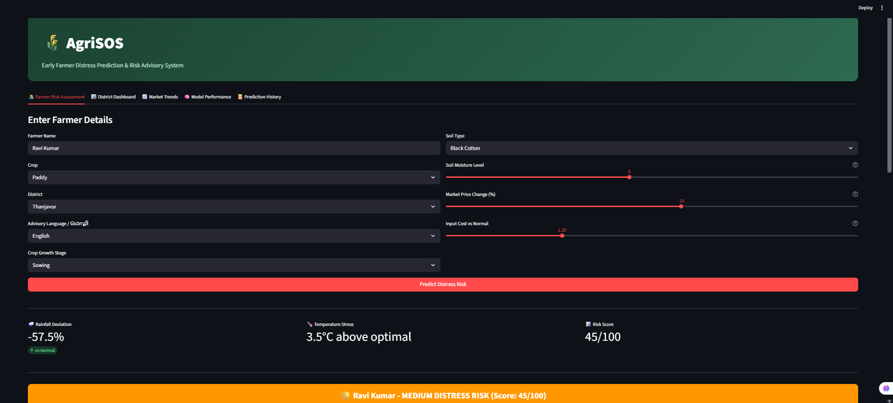
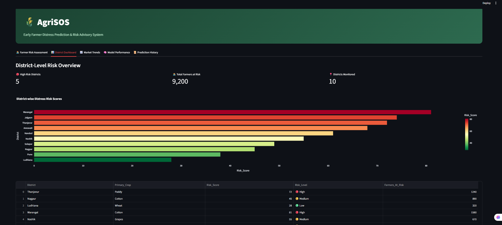
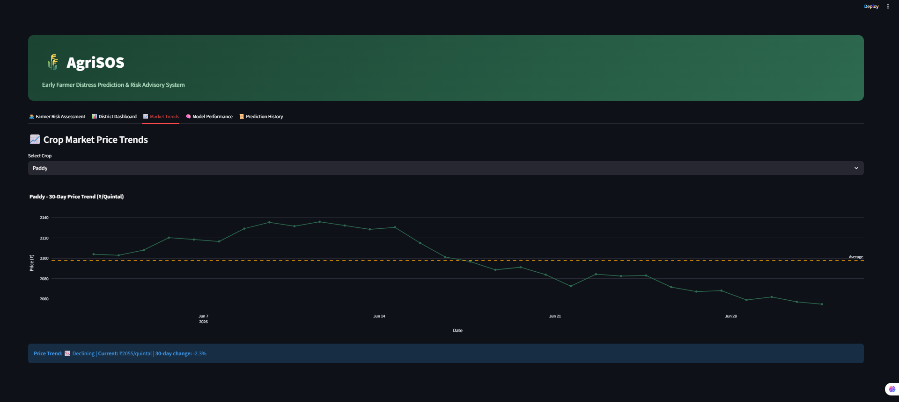
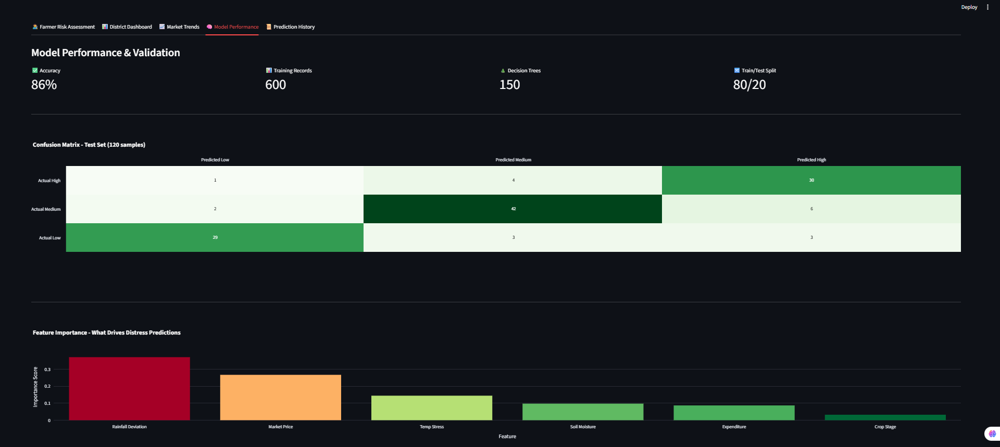
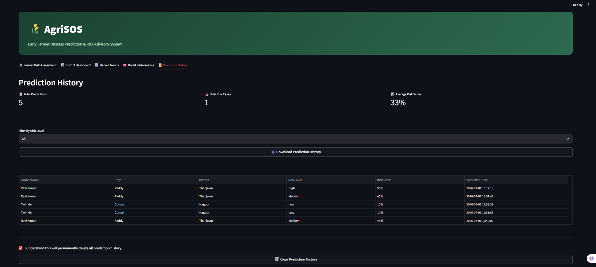

# 🌾 AgriSOS
### Early Farmer Distress Prediction & Risk Advisory System


---

## 📖 Overview

AgriSOS is an AI-powered **Early Farmer Distress Prediction & Risk Advisory System** that combines Machine Learning, real-time weather intelligence, and agricultural market insights to proactively identify farmers at risk.

The platform provides actionable recommendations, district-level analytics, SMS alerts, prediction history, downloadable reports, and interactive dashboards through a modern Streamlit application.

The objective is to enable **early intervention**, helping farmers reduce financial risk and improve decision-making before distress escalates.

---

# ✨ Features

- Random Forest based farmer distress prediction
- Real-time weather analysis using Open-Meteo API
- Market price trend visualization
- District-wise risk dashboard
- Model performance evaluation
- Prediction History with SQLite database
- Filter prediction history by risk level
- Export prediction history as CSV
- Generate downloadable PDF assessment reports
- SMS alerts using Twilio
- Multilingual recommendation support
- Feature importance visualization for model explainability

---

# 📸 Dashboard Preview

## Farmer Risk Assessment



---

## District Dashboard



---

## Market Trends



---

## Model Performance



---

## Prediction History



---

# 🏗 System Architecture

```text
                  Farmer Inputs
                        │
                        ▼
               Input Validation Layer
                        │
        ┌───────────────┴───────────────┐
        ▼                               ▼
Weather API                    Market Data
(Open-Meteo)                Agricultural Trends
        │                               │
        └───────────────┬───────────────┘
                        ▼
               Random Forest Model
                        │
                        ▼
             Farmer Risk Assessment
                        │
        ┌───────────────┼────────────────┐
        ▼               ▼                ▼
Recommendations    SMS Alerts      Prediction History
                                         │
                                   SQLite Database
                                         │
                           ┌─────────────┴─────────────┐
                           ▼                           ▼
                      CSV Export                PDF Report
```

---

# ⚙ Tech Stack

## Frontend

- Streamlit

## Backend

- Python

## Machine Learning

- Scikit-Learn
- Pandas
- NumPy

## Database

- SQLite

## Visualization

- Plotly

## APIs

- Open-Meteo API
- Twilio API

## Testing

- Pytest

---

# 📂 Project Structure

```text
AgriSOS/
│
├── agrisos/
│   ├── config/
│   ├── data/
│   ├── ml/
│   ├── services/
│   ├── ui/
│   └── utils/
│
├── assets/
├── tests/
├── logs/
├── app.py
├── generate_data.py
├── train_model.py
├── requirements.txt
├── README.md
└── .gitignore
```

---

# 🚀 Getting Started

## Clone the Repository

```bash
git clone https://github.com/Twinkle-Ghodki/AgriSOS.git

cd AgriSOS
```

---

## Install Dependencies

```bash
pip install -r requirements.txt
```

If you don't have a requirements file yet:

```bash
pip install streamlit pandas numpy scikit-learn requests plotly twilio python-dotenv reportlab pytest
```

---

## Generate Training Dataset

```bash
python generate_data.py
```

---

## Train the Machine Learning Model

```bash
python train_model.py
```

---

## Launch the Dashboard

```bash
streamlit run app.py
```

Application opens at

```
http://localhost:8501
```

---

# 🧪 Running Tests

Run all unit tests using:

```bash
pytest
```

The project includes tests for

- Validation rules
- Weather API service
- ML prediction pipeline
- SMS alerts
- Utility functions

---

# 📱 SMS Alert Configuration

Create a `.env` file.

```env
TWILIO_SID=YOUR_ACCOUNT_SID

TWILIO_TOKEN=YOUR_AUTH_TOKEN

TWILIO_PHONE=YOUR_TWILIO_PHONE
```

Twilio credentials can be obtained from

https://www.twilio.com

---

# 🧠 Machine Learning Pipeline

1. Data Generation
2. Data Cleaning
3. Feature Engineering
4. Random Forest Training
5. Model Evaluation
6. Risk Prediction
7. Recommendation Generation

---

# 📊 Dashboard Modules

## Farmer Risk Assessment

Predicts farmer distress risk using

- Weather
- Market
- Crop
- Soil
- Financial indicators

---

## District Dashboard

Displays

- District-wise average risk
- Risk distribution
- Farmer statistics

---

## Market Trends

Shows

- Crop price movement
- Historical trends
- Market insights

---

## Model Performance

Includes

- Accuracy
- Precision
- Recall
- Confusion Matrix
- Feature Importance

---

## Prediction History

- SQLite database
- Searchable records
- Risk level filtering
- CSV Export
- Clear History
- Summary Statistics

---

## 📄 PDF Report Generation

Generate a downloadable assessment report containing

- Farmer Information
- Risk Level
- Risk Score
- Weather Summary
- Recommended Actions

---

# 📊 Project Highlights

- Random Forest based prediction model
- Real-time weather intelligence
- District-level analytics dashboard
- Market trend visualization
- Prediction History using SQLite
- CSV Export
- PDF Report Generation
- SMS Alerts
- Interactive Streamlit Dashboard
- Feature Importance Visualization

---

# 🚀 Future Enhancements

- User Authentication
- Farmer Profile Management
- Cloud Deployment
- Mobile Application
- Satellite Image Analysis
- Crop Disease Detection
- Government Scheme Recommendations
- Voice-based Regional Language Assistant

---

# 📄 License

This project is intended for educational, research, and portfolio purposes.

Feel free to explore, fork, and learn from the implementation.

---

# 👩‍💻 Author

**Twinkle Ghodki**

B.Tech Computer Science Engineering

VIT Chennai

GitHub: https://github.com/Twinkle-Ghodki

LinkedIn: https://linkedin.com/in/twinkleghodki

---

⭐ If you found this project useful, consider giving it a star on GitHub!